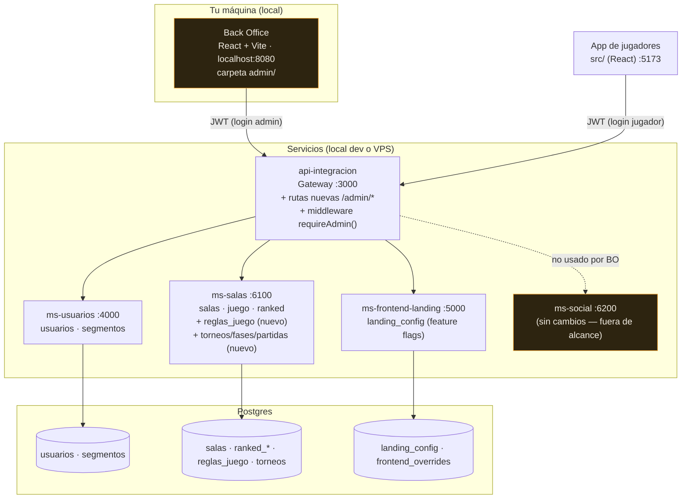

# Back Office — casos de uso y diagrama de integración

Panel de administración para gestionar usuarios, segmentos, feature flags,
torneos, reglas del juego, analítica de uso y (más adelante) CRM/pagos.
Decisiones ya fijadas:

- **Alcance**: usuarios/segmentos, feature flags, torneos, reglas del
  juego, analítica (§10), emails/CRM (§11), pago para quitar ads (§12),
  feature de negocio (§13, en discovery).
- **Acceso**: login con tu usuario admin existente (JWT reusado, nuevo
  segmento `admin` en `ms-usuarios`).
- **Integración**: vía los microservicios ya existentes — el back office
  **no** toca ninguna base de datos directamente. Es un cliente más de
  `api-integracion`, igual que el frontend de jugadores.
- **Despliegue del panel**: web app (no un ejecutable de escritorio) que
  corre en tu máquina local — ver §14, "Por qué web y no Electron".
- **Conexión al VPS**: el panel corre local, pero cuando el juego está
  desplegado en el VPS de IONOS, `api-integracion` (y por lo tanto los
  microservicios que gestiona el back office) vive ahí, no en tu máquina.
  El panel se conecta a ese `api-integracion` remoto **a través de un
  túnel SSH** (`ssh -L 3000:localhost:3000 usuario@vps`), nunca exponiendo
  el gateway directo a internet — así nadie más que vos, con tu propia
  llave SSH, puede llegar a las rutas `/admin/*`. Ver §10.4 para el detalle
  de cómo se configura ese túnel desde el panel.

---

## 1. Diagrama de integración



**Por qué un gateway compartido y no uno propio para el back office**: ya
existe `api-integracion` con JWT, CORS y proxy a los 3 microservicios
resueltos; duplicar ese cableado en un segundo gateway solo para admin
sería el mismo patrón dos veces sin necesidad. Se agrega un middleware
`requireAdmin()` (análogo a `verifyToken`, ver `api-integracion/src/jwt.ts`)
que además de validar el JWT exige `segmento === 'admin'`, y un archivo
nuevo `api-integracion/src/routes/admin.ts` con todas las rutas `/admin/*`.

**Por qué `admin/` como app separada y no una vista más de `src/`**: el
back office no comparte identidad visual con el juego (fieltro/ámbar/ficha
de dominó no aplican a una tabla de usuarios) — es un panel de datos, no
una experiencia de marca. Mezclarlo en el mismo Vite app infla el bundle
del jugador con código que nunca usa. Vive en `admin/` como su propio
`package.json` + Vite, mismo patrón monorepo que ya usan los microservicios.

---

## 2. Caso de uso 0 — Login admin

**Actor**: vos (único usuario admin, por ahora).

1. `ms-usuarios` gana un segmento `admin` (fila en `segmentos`, igual que
   `tester`/`jugador` ya existentes) — **no requiere columna ni tabla
   nueva**, es una fila más.
2. Marcás tu usuario con `segmento_id` del segmento `admin` (una sola vez,
   a mano vía `ms-usuarios` o un pequeño script).
3. El Back Office tiene su propia pantalla de login (mismo `POST
   /auth/login` del gateway, ya existente) y guarda el JWT en
   `localStorage` de esa app (namespace propio, ej. `2mino-admin-token`,
   para no compartir sesión con el frontend de jugadores en el mismo
   navegador).
4. Cada ruta `/admin/*` del gateway verifica `payload.segmento === 'admin'`
   — si no, `403`. Esto exige que el JWT lleve el segmento; hoy
   `signToken` (ver `api-integracion/src/jwt.ts`) firma `{sub, username}`
   nada más — **cambio necesario**: incluir `segmento` en el payload al
   firmar (en login/register), para no tener que consultar `ms-usuarios`
   en cada request admin solo para chequear el segmento.

**Endpoints**: `POST /auth/login` (existente, sin cambios de contrato).
**Cambio de código**: `signToken` incluye `segmento`; nuevo
`requireAdmin(req, reply)` en el gateway.

---

## 3. Caso de uso — Gestión de usuarios

| Acción | Endpoint | Estado |
|---|---|---|
| Buscar/listar usuarios (por username/email, paginado) | `GET /admin/usuarios?q=&cursor=` | **Nuevo** (ms-usuarios no tiene listado, solo `GET /usuarios/:id`) |
| Ver detalle (perfil + segmento + ELO + historial) | `GET /admin/usuarios/:id` | Nuevo endpoint que agrega, en el gateway, `GET /usuarios/:id` (ms-usuarios) + `GET /ranked/:id` (ms-salas) |
| Cambiar de segmento | `PATCH /admin/usuarios/:id/segmento` | Nuevo (ms-usuarios: `UPDATE usuarios SET segmento_id=...`) |
| Banear / reactivar cuenta | `PATCH /admin/usuarios/:id/estado` | Nuevo — requiere columna `usuarios.activo BOOLEAN DEFAULT true` (ver §6) + que `POST /auth/login` rechace si `activo=false` |
| Forzar reset de password | `POST /admin/usuarios/:id/reset-password` | Reusa la lógica de `POST /usuarios/reset-token` (ms-usuarios) ya existente, sin pasar por email — el admin ve el link/token directo |

**Por qué banear es "desactivar", no borrar**: un `DELETE` real rompe todas
las FK (salas, ranked_historial, amigos) que referencian ese `usuario_id`.
Un flag `activo` es reversible y no rompe integridad — mismo principio que
`segmentos.activo` que ya existe.

---

## 4. Caso de uso — Segmentos

Ya existe casi todo del lado de datos (`ms-usuarios/segmentos`); falta la
superficie de administración.

| Acción | Endpoint | Estado |
|---|---|---|
| Listar todos (activos e inactivos) | `GET /admin/segmentos` | Nuevo (proxy a una query nueva en ms-usuarios; hoy `GET /segmentos` solo trae los activos) |
| Crear segmento | `POST /admin/segmentos` | Nuevo |
| Editar `config` (tema/idioma/modos_juego/features/opciones) | `PATCH /admin/segmentos/:id` | Nuevo |
| Activar/desactivar | `PATCH /admin/segmentos/:id/estado` | Nuevo |

**Tabla**: `segmentos` ya existe (`ms-usuarios/src/db/pool.ts`) — cero
cambios de schema, solo rutas.

---

## 5. Caso de uso — Feature flags (landing)

Esto **ya existe casi completo** del lado de `ms-frontend-landing`
(`landing_config`, `GET /config/todas`, `PATCH /config/:clave`) — el único
gap es que el gateway nunca expuso esas rutas a nadie más que al propio
landing. El back office solo necesita que el gateway las reenvíe.

| Acción | Endpoint | Estado |
|---|---|---|
| Listar todas las opciones (habilitadas y no) | `GET /admin/feature-flags` | Nuevo en el gateway → proxy directo a `GET /config/todas` (ms-frontend-landing, ya existe) |
| Activar/desactivar una opción | `PATCH /admin/feature-flags/:clave` | Nuevo en el gateway → proxy directo a `PATCH /config/:clave` (ya existe) |

**Tabla**: `landing_config` ya existe. Cero cambios de schema.

---

## 6. Caso de uso — Reglas del juego

Hoy varias constantes de la partida están **hardcodeadas** en el código de
`ms-salas` (no en base de datos), lo que significa que hoy **no se pueden
cambiar sin re-deployar**:

| Constante | Dónde vive hoy | Qué controla |
|---|---|---|
| `ELO_INICIAL = 1000` | `ms-salas/src/game/elo.ts` | ELO con el que arranca un jugador nuevo |
| `K_FACTOR = 32` | `ms-salas/src/game/elo.ts` | Cuánto se mueve el ELO por partida |
| `PUNTOS_CAPICUA = 30` | `ms-salas/src/game/logic.ts` | Bonus por capicúa/tranca |
| `puntosObjetivo` permitidos (100/150/200) | Hardcodeado en el frontend (`CreateForm`) y sin validación server-side | A qué puntaje se juega una partida |
| `ESCALONES_RANGO = [50,100,200,400,800]` | `ms-salas/src/game/matchmaking.ts` | Cuánto se amplía el rango de ELO del matchmaking con el tiempo de espera |
| `PASO_MS = 15000` | ídem | Cada cuánto se amplía un escalón |
| `UMBRAL_RELLENO_MS` | ídem | Cuánto espera una party antes de rellenar con jugadores solos |
| *(no existe todavía)* | — | **Pendiente**: tiempo límite para jugar cada turno, variable según tipo de partida (casual/ranked) — ver `docs/PENDIENTES_JUEGO.md` §2. Encaja en este mismo patrón de `reglas_juego` (fila `tiempo_limite_jugada_ms`, ver ejemplo abajo). |

**Diseño**: una tabla `reglas_juego` en `ms-salas`, mismo patrón
clave→valor que `landing_config` (no reinventar el patrón — es exactamente
el mismo problema: "config editable en caliente sin redeploy").

```sql
-- ms-salas — mismo patrón que landing_config de ms-frontend-landing
CREATE TABLE IF NOT EXISTS reglas_juego (
  clave       VARCHAR(50) PRIMARY KEY,
  valor       JSONB       NOT NULL,
  descripcion TEXT,
  updated_at  TIMESTAMPTZ NOT NULL DEFAULT NOW()
);

INSERT INTO reglas_juego (clave, valor, descripcion) VALUES
  ('elo_inicial',        '1000',                    'ELO inicial de un jugador nuevo'),
  ('k_factor',           '32',                      'Sensibilidad del cambio de ELO por partida'),
  ('puntos_capicua',     '30',                      'Bonus por capicúa o tranca'),
  ('puntos_objetivo',    '[100,150,200]',           'Opciones de puntaje al crear una sala'),
  ('escalones_rango',    '[50,100,200,400,800]',    'Ampliación de rango ELO del matchmaking por tiempo de espera'),
  ('paso_escalon_ms',    '15000',                   'Milisegundos entre cada escalón de rango'),
  ('umbral_relleno_ms',  '15000',                   'Espera de una party antes de rellenar con jugadores solos'),
  -- Pendiente (docs/PENDIENTES_JUEGO.md §2): null/0 = sin límite. Un
  -- objeto por tipo de sala para que casual y ranked puedan tener
  -- tiempos distintos sin agregar una fila nueva por cada uno.
  ('tiempo_limite_jugada_ms', '{"casual":null,"ranked":null}', 'Tiempo límite por turno para jugar, según tipo de partida — null = sin límite')
ON CONFLICT (clave) DO NOTHING;
```

**Cambio de código necesario en `ms-salas`**: las funciones puras de
`elo.ts`/`matchmaking.ts`/`logic.ts` hoy leen las constantes como
`import { K_FACTOR } from './elo'` a nivel de módulo. Pasan a recibir el
valor como parámetro (ya `deltaElo(eloGanador, eloPerdedor, k = K_FACTOR)`
lo hace parcialmente) y las rutas (`ranked.ts`, `matchmaking.ts`,
`juegos.ts`) leen `reglas_juego` una vez al arrancar el proceso y cachean
en memoria (con invalidación al recibir un `PATCH`) — **no** una query a
base de datos en cada jugada, sería un costo innecesario en el hot path
del juego.

| Acción | Endpoint | Estado |
|---|---|---|
| Ver todas las reglas actuales | `GET /admin/reglas` | Nuevo (`ms-salas`) |
| Editar una regla | `PATCH /admin/reglas/:clave` | Nuevo (`ms-salas`) — valida tipo según la clave (número vs array) antes de guardar |

**Riesgo a documentar**: cambiar `elo_inicial` o `k_factor` a mitad de
camino no recalcula el ELO ya jugado — solo afecta partidas futuras. Vale
la pena que el back office lo aclare en la UI (no es un bug, es
comportamiento esperado de cualquier sistema ELO en vivo).

---

## 7. Caso de uso — Torneos

Hoy `salas.modo` acepta `'torneo'` como valor pero **no existe ningún
concepto real de torneo** (bracket, inscripción, fases) — es solo una
etiqueta más en la sala, tratada igual que `'clasico'`/`'rapido'`. Este
caso de uso creció respecto a la primera versión: ahora el admin debe poder
**configurar la estructura del torneo** (fase de grupos opcional + N fases
eliminatorias), controlar su **visibilidad**, y el sistema debe **trazar
cada partida y cada estadística** (capicúas, tranques, puntos, ELO de
torneo, victorias/derrotas) para que haya tabla de posiciones y resultado
verificable.

### 7.1 Configuración del torneo

Al crear un torneo, el admin define su estructura completa antes de abrir
inscripciones — no se decide sobre la marcha, para que el bracket se pueda
generar de forma determinística cuando arranca:

- **Fase inicial (grupos) — opcional**: `tiene_fase_inicial BOOLEAN`. Si es
  `true`, todos los inscritos juegan una fase de todos-contra-todos (o un
  número fijo de partidas por grupo) hasta que cada uno alcance
  `puntos_clasificacion` puntos acumulados; los mejores N pasan a la
  primera fase eliminatoria. Si es `false`, el torneo arranca directo en
  eliminación directa con los inscritos ya emparejados.
- **Fases eliminatorias — configurable**: `num_fases_eliminatorias INT`
  (ej. 1 = solo la final, 2 = semifinal + final, 3 = cuartos + semi + final).
  Cada fase es de eliminación directa a `puntos_objetivo` de esa fase — el
  perdedor queda fuera, no hay revancha.
- **Visibilidad**: `visibilidad VARCHAR(10) CHECK (visibilidad IN
  ('publico','privado'))`. Público aparece listado para cualquier jugador
  en el matchmaking/salas; privado solo es visible/inscribible vía
  `codigo_invitacion` (mismo patrón que ya usan las parties de sala, no un
  mecanismo nuevo).
- **Inscripción estrictamente en pareja**: a diferencia de las salas
  normales (que admiten 1v1 y 2v2), un torneo **siempre se juega en
  equipos de 2** — se inscribe la pareja completa, nunca un jugador suelto.
  Esto simplifica el bracket (siempre son equipos vs. equipos, nunca hay
  que rellenar con desconocidos a mitad de fase) y es coherente con la
  regla real de dominó ya implementada en `logic.ts` (equipos fijos que se
  sientan enfrentados). `torneos.max_jugadores` deja de aceptar `2`
  (1v1 sin sentido para "estrictamente en pareja") — queda fijo en `4`
  (dos equipos de 2).

### 7.2 Schema

```sql
-- ms-salas — torneos configurables: fase de grupos opcional +
-- N fases eliminatorias, visibilidad pública/privada.
CREATE TABLE IF NOT EXISTS torneos (
  id                     UUID        PRIMARY KEY DEFAULT gen_random_uuid(),
  nombre                 VARCHAR(80) NOT NULL,
  estado                 VARCHAR(20) NOT NULL DEFAULT 'inscripcion'
                         CHECK (estado IN ('inscripcion','fase_inicial','eliminatoria','finalizado','cancelado')),
  modo                   VARCHAR(20) NOT NULL DEFAULT 'clasico',
  max_jugadores          INT         NOT NULL DEFAULT 4 CHECK (max_jugadores = 4), -- siempre 2 equipos de 2, un torneo nunca es 1v1
  max_equipos            INT         NOT NULL,
  puntos_objetivo        INT         NOT NULL DEFAULT 100,   -- puntaje de cada partida individual
  tiene_fase_inicial     BOOLEAN     NOT NULL DEFAULT true,
  puntos_clasificacion   INT,                                -- puntos acumulados en fase inicial para clasificar (NULL si tiene_fase_inicial=false)
  clasifican_por_grupo   INT         NOT NULL DEFAULT 2,     -- cuántos pasan de la fase inicial a la primera eliminatoria
  num_fases_eliminatorias INT        NOT NULL DEFAULT 1 CHECK (num_fases_eliminatorias >= 1),
  visibilidad            VARCHAR(10) NOT NULL DEFAULT 'publico'
                         CHECK (visibilidad IN ('publico','privado')),
  codigo_invitacion      VARCHAR(10),                        -- solo si visibilidad='privado', mismo patrón que codigo de sala
  fecha_inicio           TIMESTAMPTZ NOT NULL,               -- fecha prevista de arranque, definida por el admin al crear
  fecha_fin              TIMESTAMPTZ NOT NULL,               -- fecha límite prevista de cierre, definida por el admin al crear
  creado_por             UUID        NOT NULL,
  created_at             TIMESTAMPTZ NOT NULL DEFAULT NOW(),
  inicia_at              TIMESTAMPTZ,                        -- momento REAL en que se ejecutó POST /admin/torneos/:id/iniciar (puede diferir de fecha_inicio)
  finalizado_at          TIMESTAMPTZ,                        -- momento REAL en que terminó (puede diferir de fecha_fin)
  CHECK (fecha_fin > fecha_inicio)
);

-- Fases reales del torneo, generadas al iniciar según la configuración de
-- arriba (1 fila 'inicial' si tiene_fase_inicial, + N filas 'eliminatoria').
-- Existir como filas (y no solo como config) permite trazar en qué fase
-- está cada partida y su tabla de posiciones de forma independiente.
CREATE TABLE IF NOT EXISTS torneo_fases (
  id              UUID        PRIMARY KEY DEFAULT gen_random_uuid(),
  torneo_id       UUID        NOT NULL REFERENCES torneos(id) ON DELETE CASCADE,
  tipo            VARCHAR(20) NOT NULL CHECK (tipo IN ('inicial','eliminatoria')),
  orden           INT         NOT NULL,             -- 0 = fase inicial (si existe), 1..N = eliminatorias en orden
  nombre          VARCHAR(40) NOT NULL,              -- 'Fase de grupos' / 'Cuartos de final' / 'Semifinal' / 'Final'
  puntos_objetivo INT         NOT NULL,
  ventana_inicio  TIMESTAMPTZ NOT NULL,              -- desde cuándo se pueden jugar partidas de esta fase
  ventana_fin     TIMESTAMPTZ NOT NULL,              -- límite para haber jugado todas las partidas de esta fase
  estado          VARCHAR(20) NOT NULL DEFAULT 'pendiente'
                  CHECK (estado IN ('pendiente','en_curso','finalizada')),
  UNIQUE (torneo_id, orden),
  CHECK (ventana_fin > ventana_inicio)
);

-- Unidad de inscripción y de estadística: SIEMPRE una pareja, nunca un
-- jugador suelto (a diferencia de ranked, donde un solo puede hacer cola
-- y matchmaking le arma pareja). La inscripción es en DOS PASOS: el
-- primer jugador registra el equipo (queda 'pendiente', con jugador2_id
-- en NULL) y comparte un código/link con su compañero; el compañero se
-- une con ese código y completa sus propios datos — recién ahí el equipo
-- pasa a 'completo' y puede participar. Ningún equipo con estado
-- 'pendiente' es tomado en cuenta al iniciar el torneo o una fase.
CREATE TABLE IF NOT EXISTS torneo_equipos (
  id                UUID        PRIMARY KEY DEFAULT gen_random_uuid(),
  torneo_id         UUID        NOT NULL REFERENCES torneos(id) ON DELETE CASCADE,
  nombre            VARCHAR(40),                      -- opcional, ej. "Los Capicúas"; si no se define, se muestra "user1 & user2"
  estado            VARCHAR(20) NOT NULL DEFAULT 'pendiente'
                    CHECK (estado IN ('pendiente','completo')),
  codigo_equipo     VARCHAR(10) NOT NULL UNIQUE,       -- código corto que jugador1 comparte para que jugador2 se una (mismo generador que codigo_invitacion de salas/torneo)
  jugador1_id       UUID        NOT NULL,
  jugador1_username VARCHAR(20) NOT NULL,
  jugador2_id       UUID,                              -- NULL mientras el equipo está 'pendiente'
  jugador2_username VARCHAR(20),
  inscrito_at       TIMESTAMPTZ NOT NULL DEFAULT NOW(), -- cuando jugador1 creó el equipo
  completado_at     TIMESTAMPTZ,                        -- cuando jugador2 se unió (NULL si sigue pendiente)
  eliminado_en      UUID        REFERENCES torneo_fases(id),  -- NULL mientras sigue en carrera; se setea a la fase en que cayó
  -- Estadísticas del torneo (independientes del ELO global de ranked):
  elo_torneo        INT         NOT NULL DEFAULT 1000,
  puntos            INT         NOT NULL DEFAULT 0,   -- acumulado de la fase inicial (para la tabla de posiciones)
  victorias         INT         NOT NULL DEFAULT 0,
  derrotas          INT         NOT NULL DEFAULT 0,
  capicuas          INT         NOT NULL DEFAULT 0,
  tranques          INT         NOT NULL DEFAULT 0,
  UNIQUE (torneo_id, jugador1_id),
  UNIQUE (torneo_id, jugador2_id),                 -- ningún jugador puede estar en dos equipos del mismo torneo (Postgres permite múltiples NULL en una UNIQUE, así que no bloquea equipos aún pendientes)
  CHECK (jugador1_id <> jugador2_id)
);

-- Registro de cada partida jugada dentro del torneo — trazabilidad completa,
-- una fila por partida (no se sobreescribe nada, a diferencia de juegos.partida
-- que sí se sobreescribe jugada a jugada; acá el interés es el resultado final
-- de cada partida, no el replay jugada a jugada, que ya vive en la sala misma).
-- Siempre equipo vs. equipo — nunca jugador suelto vs. jugador suelto.
CREATE TABLE IF NOT EXISTS torneo_partidas (
  id                UUID        PRIMARY KEY DEFAULT gen_random_uuid(),
  torneo_id         UUID        NOT NULL REFERENCES torneos(id) ON DELETE CASCADE,
  fase_id           UUID        NOT NULL REFERENCES torneo_fases(id) ON DELETE CASCADE,
  sala_id           UUID        NOT NULL REFERENCES salas(id) ON DELETE CASCADE,
  ronda             INT         NOT NULL DEFAULT 1,       -- para desempatar cruces dentro de una misma fase eliminatoria
  equipo1_id        UUID        NOT NULL REFERENCES torneo_equipos(id),
  equipo2_id        UUID        NOT NULL REFERENCES torneo_equipos(id),
  fecha_programada  TIMESTAMPTZ,                          -- horario asignado a ESTA partida (solo aplica a fases eliminatorias; en fase inicial se juega libremente dentro de la ventana_inicio/ventana_fin de la fase)
  ganador_equipo_id UUID        REFERENCES torneo_equipos(id),  -- NULL mientras la partida está en curso
  puntos_equipo1    INT         NOT NULL DEFAULT 0,
  puntos_equipo2    INT         NOT NULL DEFAULT 0,
  hubo_capicua      BOOLEAN     NOT NULL DEFAULT false,
  hubo_tranque      BOOLEAN     NOT NULL DEFAULT false,
  jugada_at         TIMESTAMPTZ,
  created_at        TIMESTAMPTZ NOT NULL DEFAULT NOW(),
  CHECK (equipo1_id <> equipo2_id)
);
```

**Fechas: por qué hay tres niveles distintos**:
- `torneos.fecha_inicio`/`fecha_fin` — el rango general que el admin
  publica al crear el torneo (lo que ve el jugador en el listado: "corre
  del 10 al 24 de agosto"). Es informativo/de marketing, no bloquea nada
  por sí solo.
- `torneo_fases.ventana_inicio`/`ventana_fin` — aplica sobre todo a la
  **fase inicial** (grupos): como ahí se juega todos-contra-todos sin un
  cruce fijo por horario, lo que se necesita es una ventana de tiempo
  dentro de la cual los equipos deben completar sus partidas del grupo
  (ej. "toda la fase de grupos se juega entre el 10 y el 17 de agosto").
  `avanzar-fase` puede usar `ventana_fin` para forzar el cierre de la fase
  aunque no todos hayan completado sus partidas.
- `torneo_partidas.fecha_programada` — aplica a **cada partida individual
  de una fase eliminatoria** (cuartos, semis, final): ahí sí hay un cruce
  fijo (equipo A vs. equipo B) y tiene sentido asignarle un horario
  puntual, no una ventana — es eliminación directa, se juega en un momento
  concreto, no "en cualquier momento de la semana".

**Por qué las estadísticas viven en `torneo_equipos` y no se recalculan
cada vez desde `torneo_partidas`**: se actualizan incrementalmente al
cerrar cada partida (mismo patrón que ya usa `ranked_historial`/ELO
global, ver `ms-salas/src/game/elo.ts`) — evita un `SUM()`/`COUNT()` sobre
todas las partidas del torneo cada vez que alguien abre la tabla de
posiciones. `torneo_partidas` queda como el registro auditable (de dónde
salió cada número), no como la fuente que se consulta en el hot path de
la UI.

**Por qué la unidad es el equipo y no el jugador individual**: el pedido
es que los torneos se jueguen **estrictamente en pareja** — a diferencia
de una sala normal, acá no existe "un jugador se anota solo y se le arma
pareja". Todo el resto del sistema (fases, partidas, tabla de posiciones,
ELO de torneo, capicúas/tranques) cuelga de ese equipo, nunca de un
jugador suelto. Un `UNIQUE (torneo_id, jugador_id)` en ambas columnas
impide que la misma persona quede en dos equipos del mismo torneo.

**Por qué la inscripción es en dos pasos y no un formulario que pide
ambos jugadores a la vez**: quien se inscribe primero normalmente no tiene
todavía las respuestas de su compañero a mano (teléfono, cédula, etc. —
ver `torneo_campos_inscripcion` en §7.4), y forzar a completar el
formulario de otra persona en su nombre es mala UX y datos poco confiables.
En cambio, jugador1 registra el equipo (queda `estado='pendiente'`, con
`jugador2_id` en `NULL`) y el sistema genera un `codigo_equipo` corto —
el mismo jugador1 lo comparte por el canal que quiera (link directo,
código para pegar, mensaje de `ms-social`). Jugador2 entra a ese
link/código, ve a quién se está uniendo, completa **sus propios** datos de
contacto, y recién ahí el equipo pasa a `estado='completo'`. Un equipo
`pendiente` no cuenta para el cupo del torneo ni participa en el sorteo de
`iniciar`/`avanzar-fase` — evita que el bracket se arme con una pareja
incompleta.

**Por qué `elo_torneo` es un campo aparte y no el ELO global de
`ranked_historial`**: mezclar el ranking competitivo real del jugador con
el resultado de un torneo puntual (que puede ser casual, con reglas de
puntaje distintas) contaminaría su ELO real. `elo_torneo` arranca en 1000
para todos al inscribirse y solo tiene sentido dentro de ese torneo — se
calcula con el mismo `deltaElo()` de `elo.ts` (reutilizado, no
reimplementado), aplicado partida a partida dentro del torneo.

### 7.3 Endpoints

| Acción | Endpoint | Estado |
|---|---|---|
| Crear torneo (config completa: fases, puntos, visibilidad, fecha de inicio/fin y ventanas de cada fase) | `POST /admin/torneos` | Nuevo |
| Listar torneos | `GET /admin/torneos` | Nuevo |
| Ver detalle (config + fases + equipos inscritos + tabla de posiciones) | `GET /admin/torneos/:id` | Nuevo |
| Inscribir un equipo manualmente (bypass admin: crea directo con `estado='completo'`, sin pasar por el flujo de código de §7.4) | `POST /admin/torneos/:id/equipos` | Nuevo — valida que ninguno de los dos jugadores esté ya en otro equipo del torneo |
| Ver partidas jugadas de un torneo (filtrable por fase) | `GET /admin/torneos/:id/partidas?fase=` | Nuevo — lee `torneo_partidas` |
| Ver estadísticas de un equipo (capicúas, tranques, victorias, ELO de torneo) | `GET /admin/torneos/:id/equipos/:equipoId` | Nuevo |
| Iniciar torneo (genera fases + salas de la primera fase) | `POST /admin/torneos/:id/iniciar` | Nuevo — arma cruces equipo-vs-equipo (mismo algoritmo de emparejamiento balanceado que ya existe en `matchmaking.ts`, aplicado por equipo en vez de por jugador) y llama a la creación de sala **existente** (`crearSala`/lógica de `salas.ts`) por cada partida, siempre 2v2 |
| Avanzar de fase (cierra la fase actual, calcula clasificados, genera la siguiente) | `POST /admin/torneos/:id/avanzar-fase` | Nuevo — en fase inicial usa `clasifican_por_grupo` + `puntos` acumulados por equipo; en eliminatorias, el equipo ganador de cada partida en `torneo_partidas` avanza directo |
| Programar/reprogramar el horario de una partida de fase eliminatoria | `PATCH /admin/torneos/:id/partidas/:partidaId/fecha` | Nuevo — solo aplica a partidas con `fase.tipo='eliminatoria'`; setea `torneo_partidas.fecha_programada` |
| Cancelar / finalizar | `PATCH /admin/torneos/:id/estado` | Nuevo |
| Generar/rotar código de invitación (torneos privados) | `POST /admin/torneos/:id/codigo` | Nuevo — mismo generador de código que ya usan las salas |

**Cómo se registra cada partida sin duplicar lógica de juego**: cuando una
sala vinculada a `torneo_partidas` termina (evento que `ms-salas` ya emite
para cerrar la sala normal), un hook agrega una fila a `torneo_partidas`
con el resultado (equipo1/equipo2/ganador) y actualiza `torneo_equipos` —
la lógica de "quién ganó", "hubo capicúa", "hubo tranque" ya existe entera
en `logic.ts` (son los mismos datos que hoy se guardan en `juegos.partida`
al cerrar la mano, y los equipos de la sala ya coinciden 1:1 con
`torneo_equipos` porque el torneo fuerza siempre parejas fijas), solo se
**también** persiste en la tabla del torneo en vez de descartarse.

**Fuera de alcance de la primera versión** (anotado para no sobre-diseñar
ahora): premios/rewards automáticos, notificar a los inscritos al pasar de
fase (se conecta después reusando `notificaciones` de `ms-social`, igual
que en la v1), soporte para brackets con "bye" cuando el número de
inscritos no es potencia de 2 (para la primera versión, `iniciar` valida
que la cantidad de inscritos calce con `num_fases_eliminatorias`).

### 7.4 Flujo frontend — Torneos en el dashboard del jugador

El jugador nunca ve el Back Office. Ve una entrada "Torneos" en su
dashboard (`src/`) **si y solo si** el admin la activó y ese jugador
específico califica para verla.

**Activación global (feature flag, mismo patrón de §5)**: clave nueva
`torneos_habilitado` en `landing_config` — el dashboard consulta su config
resuelta (segmento + override) como ya hace hoy para cualquier otra
opción, y solo pinta la card "Torneos" si viene en `true`. Apagarla es
gratis: no requiere tocar `ms-salas`, los torneos ya creados simplemente
dejan de listarse hasta reactivarla.

**A quién se le muestra cada torneo (targeting), no solo si se muestra la
sección**: dos capas independientes, para separar "¿existe la
funcionalidad?" de "¿quién ve este torneo puntual?":

- La sección "Torneos" completa depende de `torneos_habilitado` (arriba).
- Dentro de esa sección, **cada torneo individual** se filtra por rango de
  ELO. Se agregan dos columnas nuevas a `torneos`:

```sql
ALTER TABLE torneos ADD COLUMN IF NOT EXISTS elo_min INT;  -- NULL = sin piso
ALTER TABLE torneos ADD COLUMN IF NOT EXISTS elo_max INT;  -- NULL = sin techo
```

Si ambos son `NULL`, el torneo es para todos. `GET /torneos` (endpoint de
**jugador**, no de admin — nuevo, distinto de `GET /admin/torneos`) filtra
server-side comparando el ELO ranked actual del usuario (`ranked_historial`,
ya existente) contra `[elo_min, elo_max]` del torneo, además de `estado
IN ('inscripcion')` y `visibilidad='publico' OR codigo_invitacion
correcto`. El admin arma el rango en el mismo formulario de creación de
`POST /admin/torneos` (§7.3) — no es una tabla nueva, son dos columnas más
en `torneos`, mismo espíritu que el resto de la config del torneo (fases,
puntos, visibilidad) definida una sola vez al crearlo.

**Listado de torneos (vista jugador)**: `GET /torneos` devuelve solo los
que ese usuario puede ver (por flag global + ELO + visibilidad), con
nombre, estado, fecha de inicio y cupo. Click entra al detalle.

**Detalle de torneo — info estética personalizada por torneo**: el admin
puede adjuntar un bloque HTML propio por torneo (reglas especiales,
premios, sponsors, imágenes) en vez de quedar atado a un template
genérico igual para todos:

```sql
ALTER TABLE torneos ADD COLUMN IF NOT EXISTS info_html TEXT;
```

El Back Office edita este campo con un editor de texto/HTML simple
(`PATCH /admin/torneos/:id/info`, nuevo). El frontend de jugadores lo
renderiza **sanitizado** — nunca `dangerouslySetInnerHTML` directo sobre
contenido que viene de un campo editable, aunque el editor sea "solo
admin": se pasa por `DOMPurify` (o equivalente) en el cliente antes de
inyectarlo, para no abrir un vector de XSS persistente si alguna vez ese
campo se llena copiando HTML de otro lado. Si `info_html` es `NULL`, se
muestra un detalle genérico armado con los datos estructurados (fases,
puntos, fecha) que ya existen en `torneos`/`torneo_fases`.

**Formulario de inscripción — campos configurables desde el Back Office**:
hoy los datos de contacto que un torneo puede pedir (teléfono, cédula,
dirección, etc.) varían de un torneo a otro — no tiene sentido
hardcodearlos en el frontend. Se definen por torneo, en el Back Office, y
el frontend los renderiza dinámicamente:

```sql
-- Catálogo de campos que este torneo pide en la inscripción — el admin
-- arma este set en el Back Office al crear/editar el torneo, antes de
-- abrir inscripciones.
CREATE TABLE IF NOT EXISTS torneo_campos_inscripcion (
  id         UUID        PRIMARY KEY DEFAULT gen_random_uuid(),
  torneo_id  UUID        NOT NULL REFERENCES torneos(id) ON DELETE CASCADE,
  clave      VARCHAR(40) NOT NULL,             -- 'telefono', 'cedula', 'direccion', 'nombre_completo'...
  etiqueta   VARCHAR(80) NOT NULL,             -- texto que ve el jugador en el form
  tipo       VARCHAR(20) NOT NULL DEFAULT 'texto'
             CHECK (tipo IN ('texto','numero','telefono','email')),
  requerido  BOOLEAN     NOT NULL DEFAULT true,
  orden      INT         NOT NULL DEFAULT 0,
  UNIQUE (torneo_id, clave)
);

-- Respuestas: una fila por jugador (no por equipo — cada integrante de la
-- pareja llena sus propios datos de contacto) por campo configurado.
CREATE TABLE IF NOT EXISTS torneo_inscripcion_datos (
  equipo_id  UUID        NOT NULL REFERENCES torneo_equipos(id) ON DELETE CASCADE,
  jugador_id UUID        NOT NULL,
  campo_id   UUID        NOT NULL REFERENCES torneo_campos_inscripcion(id) ON DELETE CASCADE,
  valor      TEXT        NOT NULL,
  PRIMARY KEY (equipo_id, jugador_id, campo_id)
);
```

**Por qué es una tabla de campos por torneo y no columnas fijas en
`torneo_equipos`**: distintos torneos piden distinta información (un
torneo casual entre amigos puede no pedir cédula; uno con inscripción
paga sí) — columnas fijas obligarían a un schema con todos los campos
posibles siempre presentes (la mayoría `NULL`) y a un redeploy cada vez
que se quiera pedir un dato nuevo. El patrón EAV (`campo` + `valor`) es
exactamente lo que ya se usa para `landing_config`/`reglas_juego`: config
que cambia sin tocar código.

**Flujo completo del lado del jugador — inscripción en dos pasos, porque
el torneo exige pareja**:

1. Ve la card "Torneos" en el dashboard (si `torneos_habilitado`).
2. Entra al listado (`GET /torneos`) — solo ve los que su ELO y
   visibilidad permiten.
3. Entra al detalle — ve el `info_html` del admin (o el genérico).
4. Si el torneo está en `estado='inscripcion'`, ve el botón "Inscribirme"
   → completa **su propio** formulario dinámico
   (`torneo_campos_inscripcion` de ese torneo) →
   `POST /torneos/:id/equipos` (endpoint de jugador; crea el equipo con
   `estado='pendiente'`, `jugador1_id` = quien se inscribe, `jugador2_id`
   en `NULL`, y genera `codigo_equipo`). La respuesta trae ese código y un
   link corto listo para compartir (mismo estilo que el link de invitación
   de una party de sala).
5. El jugador comparte el link/código con su compañero por el canal que
   quiera (chat de `ms-social`, WhatsApp, lo que sea — el link no requiere
   estar dentro de la app para abrirse, solo estar logueado).
6. Su compañero abre el link (o pega el código desde el detalle del
   torneo) → ve con quién se está uniendo → completa **sus propios** datos
   de contacto → `POST /torneos/:id/equipos/:codigo/unirse` (endpoint de
   jugador; valida que el equipo siga `pendiente`, que este jugador no
   esté ya en otro equipo del mismo torneo, setea `jugador2_id` +
   `completado_at`, y pasa el equipo a `estado='completo'`).
7. Recién con `estado='completo'` el equipo cuenta para el cupo del
   torneo y entra en el sorteo cuando el admin ejecuta
   `iniciar`/`avanzar-fase`.

**Endpoints nuevos de jugador** (namespace propio, no `/admin/*` — estos sí
los usa el frontend de `src/`, no el Back Office):

| Acción | Endpoint |
|---|---|
| Listar torneos visibles para mí | `GET /torneos` |
| Ver detalle de un torneo | `GET /torneos/:id` |
| Crear mi equipo (paso 1: me inscribo yo, genera código para mi pareja) | `POST /torneos/:id/equipos` |
| Ver un equipo pendiente por su código (antes de unirme, para confirmar a quién me uno) | `GET /torneos/:id/equipos/:codigo` |
| Unirme a un equipo pendiente (paso 2: mi pareja completa sus datos) | `POST /torneos/:id/equipos/:codigo/unirse` |

**Endpoints nuevos de admin (Back Office) para lo de arriba**:

| Acción | Endpoint |
|---|---|
| Editar info estética (HTML) del torneo | `PATCH /admin/torneos/:id/info` |
| Definir/editar campos de inscripción del torneo | `PUT /admin/torneos/:id/campos-inscripcion` |
| Ver las respuestas de inscripción de un equipo (datos de contacto) | `GET /admin/torneos/:id/equipos/:equipoId/datos` |
| Ver equipos pendientes (inscritos a medias, sin compañero) | `GET /admin/torneos/:id/equipos?estado=pendiente` |

---

## 8. Resumen de impacto

| Servicio | Tablas nuevas | Cambios de schema | Rutas nuevas |
|---|---|---|---|
| `ms-usuarios` | — | `usuarios.activo BOOLEAN DEFAULT true` (ban) + fila `segmentos` para `admin` | `GET /usuarios` (listado/búsqueda) |
| `ms-salas` | `reglas_juego`, `torneos`, `torneo_fases`, `torneo_equipos`, `torneo_partidas`, `torneo_campos_inscripcion`, `torneo_inscripcion_datos` | `torneos.elo_min`/`elo_max`/`info_html` | Admin: ver §6/§7. Jugador: `GET /torneos`, `GET /torneos/:id`, `POST /torneos/:id/inscribirme` |
| `ms-frontend-landing` | — | fila nueva en `landing_config` (`torneos_habilitado`) | Ninguna (ya expone lo necesario) |
| `api-integracion` | — | `signToken` incluye `segmento` | `admin.ts` nuevo: agrupa todas las `/admin/*` con `requireAdmin()` |
| `admin/` (nuevo) | — | — | App Vite/React nueva, corre local en otro puerto (ej. 8080) |
| `src/` (jugadores) | — | — | Vista nueva `torneos` en `App.tsx` (listado + detalle + formulario de inscripción dinámico) |

## 9. Orden sugerido de implementación

1. Segmento `admin` + `signToken` con segmento + `requireAdmin()` — sin
   esto no hay manera de proteger nada de lo demás.
2. Feature flags: es el más barato (cero tablas nuevas, cero lógica nueva,
   solo cablear rutas) — buen primer entregable para validar el patrón
   completo (login admin → app `admin/` → gateway → microservicio) antes
   de construir las partes más grandes.
3. Usuarios y segmentos (CRUD + ban).
4. Reglas del juego (requiere tocar `elo.ts`/`matchmaking.ts`/`logic.ts`
   para leer de `reglas_juego` en vez de constantes — el cambio más
   delicado, tiene tests existentes que hay que mantener en verde).
5. Torneos — back office (crear/configurar/iniciar/avanzar fases) — el más
   grande, depende de que 1-3 ya estén sólidos.
6. Flujo frontend de torneos (`src/`): card en dashboard detrás del flag
   `torneos_habilitado`, listado filtrado por ELO, detalle con `info_html`
   sanitizado, formulario dinámico de inscripción — depende por completo
   de que el paso 5 ya tenga el back office de torneos funcionando (no
   tiene sentido construir la UI de inscripción antes de que existan
   torneos reales para inscribirse).
7. Conexión al VPS por SSH + Dashboard de analítica (§10) — depende de que
   el panel ya sepa hablar con un `api-integracion` real (local hoy,
   remoto vía túnel después); es lo primero que se vuelve imprescindible
   apenas el juego esté desplegado de verdad con usuarios reales.
8. Emails/CRM (§11) y pago para quitar ads (§12) — dependen de tener
   usuarios reales y tráfico que analizar (paso 7) antes de que tenga
   sentido invertir en retención/monetización.
9. Feature de negocio (§13) — todavía en discovery, sin alcance fijado.

---

## 10. Caso de uso — Conexión al VPS + Dashboard de analítica

### 10.1 Por qué SSH y no exponer el gateway

Hoy `api-integracion` en el VPS solo necesita estar expuesto al público en
el puerto que sirve al juego (lo que ya consumen los jugadores). Abrir además
las rutas `/admin/*` a internet — aunque estén protegidas por
`requireAdmin()` — es superficie de ataque innecesaria para un panel que
usás solo vos. En cambio, el back office arma un **túnel SSH local** hacia
el VPS:

```bash
ssh -N -L 3000:127.0.0.1:3000 admin@vps-2mino
```

Esto reenvía `localhost:3000` de tu máquina al puerto real de
`api-integracion` en el VPS **sin que ese puerto esté expuesto a
internet** — solo quien tenga tu llave SSH (o la del VPS) puede llegar ahí,
ni siquiera hace falta abrir el puerto 3000 en el firewall del VPS más
allá de `localhost`. El back office simplemente apunta su `VITE_API_URL`
a `http://localhost:3000` sin saber si ese `3000` es local (dev) o
túnel-hacia-VPS (producción) — mismo cliente HTTP, cambia solo la
variable de entorno.

**En el panel**: una pantalla de "Conexión" donde configurás host/usuario/
puerto del VPS y guardás el comando de túnel; el panel no ejecuta `ssh`
por vos automáticamente (evitar manejar tu llave privada desde la app) —
te muestra el comando exacto para copiar y correrlo vos mismo en una
terminal antes de abrir el panel. Nunca se pide ni se guarda una
contraseña o passphrase de la llave dentro de la app.

### 10.2 Dashboard de analítica

Necesita datos que hoy **no se registran en ningún lado** — el primer
paso real es instrumentar antes de poder mostrar:

| Métrica | De dónde sale | Estado |
|---|---|---|
| Usuarios nuevos (por día/semana) | `COUNT(usuarios.created_at)` agrupado — la columna ya existe | Solo falta el endpoint agregador |
| Sesiones activas (ahora mismo) | **Nuevo**: requiere que algo registre "conectado"/"desconectado" — hoy no existe presencia global, solo la presencia de `ms-social` (amigos) | Nuevo: tabla o cache en memoria de conexiones activas en el gateway |
| Partidas jugadas (por día) | `COUNT(juegos)` con filtro por fecha — ya existe la tabla | Solo falta el endpoint agregador |
| Consumo de la página (vistas, retención) | **Nuevo**: no hay ningún tracking de páginas/eventos hoy | Nuevo: tabla `eventos_analitica` simple (`usuario_id` nullable, `tipo`, `metadata` JSONB, `created_at`) poblada por el frontend de jugadores en puntos clave (login, entrar a partida, etc.) |

```sql
-- ms-usuarios (o un microservicio nuevo ms-analitica si esto crece) —
-- registro de eventos crudo, se agrega en consultas, no se pre-calcula.
CREATE TABLE IF NOT EXISTS eventos_analitica (
  id         UUID        PRIMARY KEY DEFAULT gen_random_uuid(),
  usuario_id UUID,                            -- NULL si es un evento anónimo (ej. landing sin login)
  tipo       VARCHAR(50) NOT NULL,             -- 'login', 'registro', 'partida_iniciada', 'sesion_fin', ...
  metadata   JSONB       NOT NULL DEFAULT '{}',
  created_at TIMESTAMPTZ NOT NULL DEFAULT NOW()
);
CREATE INDEX IF NOT EXISTS idx_eventos_tipo_fecha ON eventos_analitica (tipo, created_at);
```

**Endpoints**: `GET /admin/analitica/resumen?desde=&hasta=` (usuarios
nuevos, partidas jugadas, sesiones activas actuales) y
`GET /admin/analitica/eventos?tipo=&desde=&hasta=` (serie temporal para
graficar). Todo lectura — el back office no escribe en esta tabla, solo
consulta lo que el frontend de jugadores ya reportó.

**Riesgo a documentar**: "sesiones activas" en tiempo real es el dato más
caro de los cuatro — requiere un mecanismo de heartbeat/presencia nuevo
(no reusa nada existente). Vale la pena arrancar solo con las tres
métricas basadas en tablas que ya existen (usuarios nuevos, partidas,
eventos) y dejar sesiones activas para una segunda vuelta si hace falta.

---

## 11. Caso de uso — Verificación de email y CRM

Hoy el registro (`ms-usuarios`) no verifica que el email sea real ni existe
ninguna cuenta que envíe correo a los usuarios — bloquea tanto seguridad
básica (recuperar contraseña real) como cualquier intento de CRM
(newsletters, reactivación, anuncios de torneos).

**Piezas nuevas**:
- **Proveedor de envío**: un servicio transaccional (ej. Resend/SES/Postmark
  — a decidir, no hay uno elegido todavía) configurado con una cuenta/dominio
  propio de 2mino, no una casilla personal.
- `usuarios.email_verificado BOOLEAN DEFAULT false` (columna nueva) +
  `usuarios.email_verificado_at TIMESTAMPTZ`.
- Tabla `tokens_verificacion` (mismo patrón que el reset de password que
  ya existe): `usuario_id`, `token`, `tipo` (`verificacion_email` /
  `reset_password`, unifica lo que hoy ya existe para reset), `expira_at`.
- El registro dispara un email de verificación; el login no bloquea a un
  usuario no verificado (no queremos friction dura en el juego) pero el
  back office puede filtrar/segmentar por `email_verificado` para
  cualquier campaña de CRM.

**Back office**: pantalla para ver tasa de verificación, reenviar el
email de verificación a un usuario puntual (`POST
/admin/usuarios/:id/reenviar-verificacion`), y — para CRM — armar un
envío simple a un segmento (`POST /admin/crm/campanias` con `segmento_id`
+ plantilla) que reusa el proveedor de envío de arriba. **Fuera de
alcance de la primera versión**: editor de plantillas WYSIWYG, tracking de
apertura/click — arrancar con texto plano o un HTML pegado a mano.

---

## 12. Caso de uso — Pago para quitar anuncios

Requiere: (a) que hoy existan anuncios en el frontend de jugadores (no
confirmado en qué pantallas — a relevar), y (b) un proveedor de pagos
(a elegir — Stripe es el default razonable para tarjetas
internacionales).

**Diseño mínimo**:
- `usuarios.sin_ads BOOLEAN DEFAULT false` + `usuarios.sin_ads_hasta
  TIMESTAMPTZ` (NULL = para siempre una vez pagado, o con fecha si es
  suscripción en vez de pago único — a decidir).
- El frontend de jugadores consulta ese flag (ya viene en el perfil,
  mismo patrón que `frontend_overrides`) para ocultar el/los componentes
  de ads.
- Checkout vía el proveedor elegido (Stripe Checkout hosted, para no
  manejar tarjetas directamente ni requerir PCI compliance propio) +
  webhook (`POST /webhooks/pagos`, nuevo, en `api-integracion` o
  `ms-usuarios`) que marca `sin_ads=true` al confirmarse el pago.

**Back office**: ver quién pagó (`GET /admin/usuarios/:id` ya podría
incluir esto), revertir manualmente un `sin_ads` en caso de disputa/reembolso
(`PATCH /admin/usuarios/:id/sin-ads`). **Fuera de alcance de la primera
versión**: planes múltiples, cupones, facturación — un único producto
"quitar ads" a un precio fijo es el punto de partida.

**Pendiente de decisión del usuario** (no fijado todavía): qué proveedor
de pagos, pago único vs. suscripción, y dónde viven hoy los ads en el
frontend (para saber qué ocultar).

---

## 13. Caso de uso — Feature de negocio (en discovery)

Pedido explícito: "sentarse a levantar información de cómo se hará, esto
debe integrarse con el Back Office" — **todavía no tiene alcance definido**.
Antes de diseñar tablas/endpoints acá hace falta una sesión de discovery
para responder: ¿qué es exactamente el "feature de negocio"? (¿un modelo
de negocio nuevo dentro del juego — ej. torneos pagos, sponsors,
marketplace de cosméticos —, o una herramienta de negocio para vos como
operador — ej. reportes financieros?). Esta sección queda como
placeholder intencional: no diseñar de más sin la conversación de
discovery primero.

---

## 14. Por qué el panel es web y no un ejecutable de escritorio

Se evaluó empaquetar el Back Office como app de escritorio (Electron) para
que abra como "una aplicación más de Windows" en vez de una pestaña de
navegador. Se descartó: overhead de mantener un segundo target de build
(instalador, firma, auto-actualización propia) para un panel de uso
interno que ya corre perfectamente bien en un navegador local. Decisión
final: **panel web** servido localmente (`vite dev`/`vite preview` o un
build estático servido por cualquier servidor simple), con la puerta
abierta a convertirlo en **PWA** más adelante (manifest + service worker)
si en algún momento hace falta instalarlo/usarlo offline — eso sí es
liviano de agregar sobre una web app existente, a diferencia de mantener
un empaquetado Electron completo.
