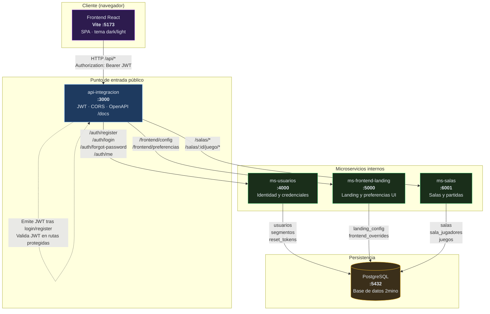
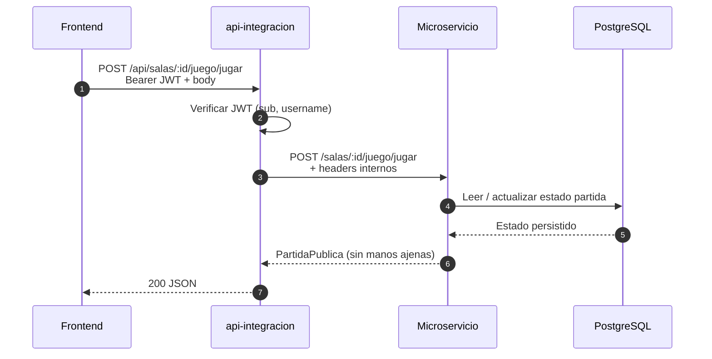

# Diagramas

Diagramas Mermaid del proyecto 2mino.

---

## Integración de servicios

Vista de cómo se conectan el frontend, el gateway público, los microservicios internos y la base de datos.

### Leyenda

| Elemento | Rol |
|----------|-----|
| **Frontend** | SPA React; en dev proxyea `/api` → `api-integracion:3000` |
| **api-integracion** | Único servicio expuesto al navegador; orquesta y autentica |
| **ms-usuarios** | Registro, login, bcrypt, tokens de reset |
| **ms-frontend-landing** | Config global del landing + overrides por usuario |
| **ms-salas** | Salas multijugador y lógica autoritativa del dominó |
| **PostgreSQL** | Base compartida; cada MS ejecuta sus migraciones al arrancar |

### Flujo de una petición autenticada

### Entornos

| Entorno | Frontend | API pública | MS internos | Postgres expuesto |
|---------|----------|-------------|-------------|-------------------|
| **Docker Compose** | `npm run dev` aparte | `:3000` | Solo red Docker | `:5432` (debug) |
| **Local (dev.ps1)** | `:5173` | `:3000` | `:4000`, `:5000`, `:6001` | `:5432` |
